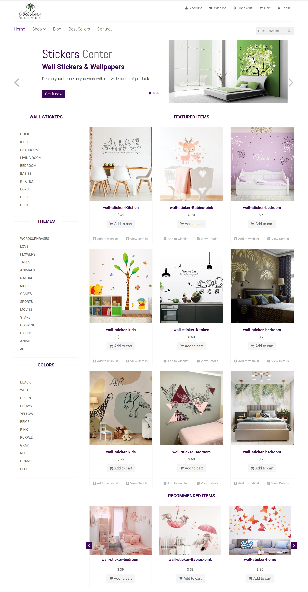
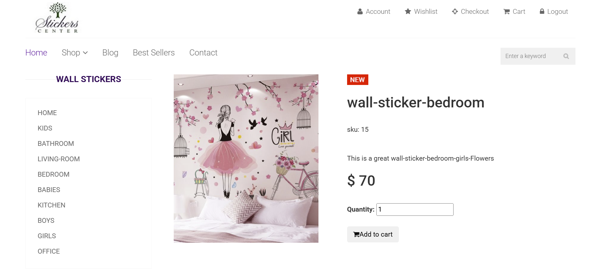
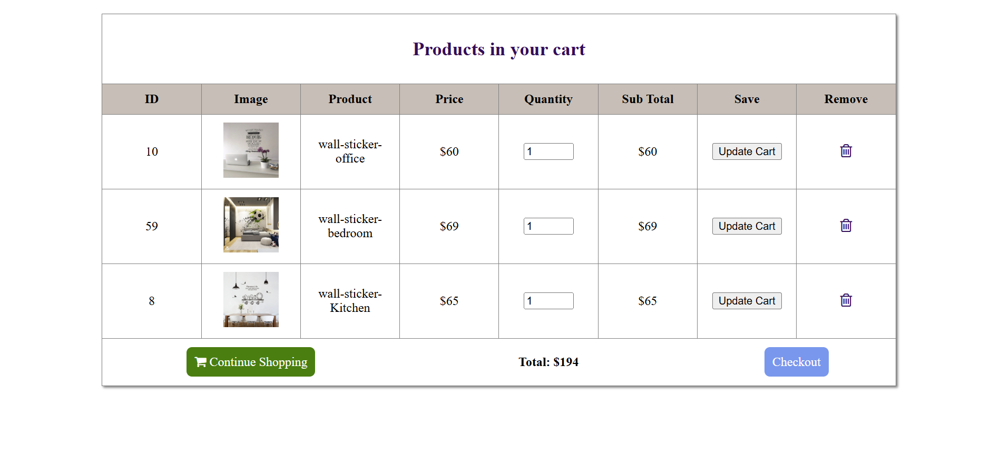
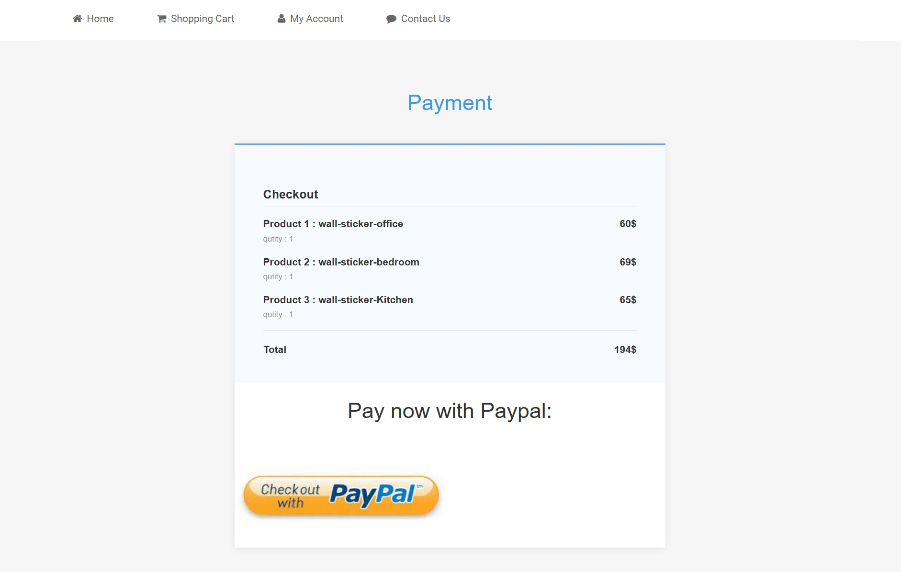
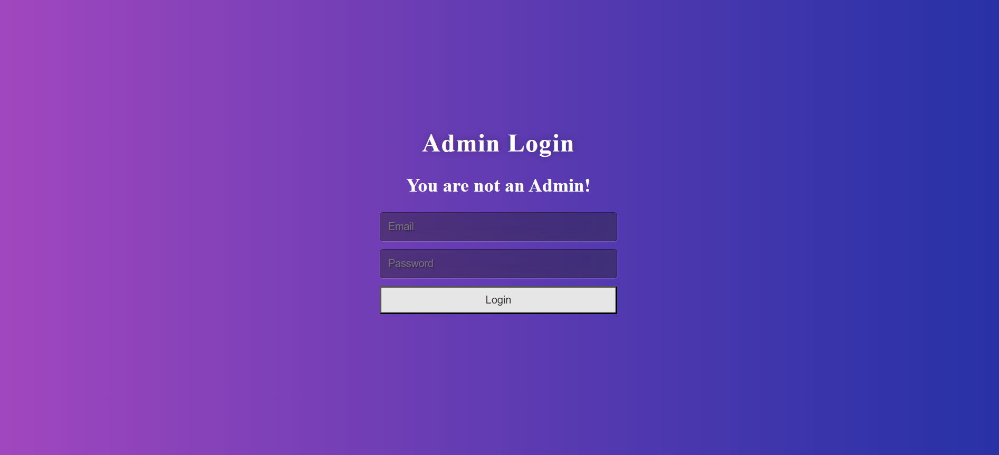
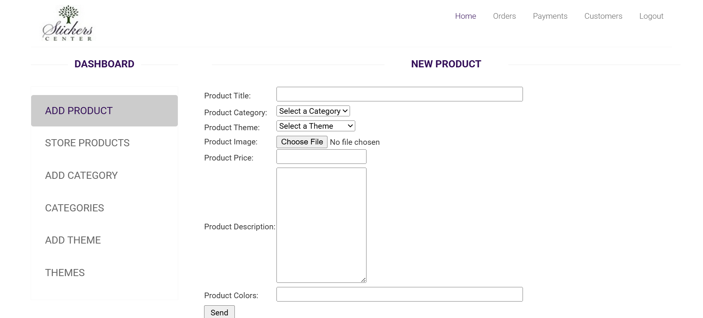

# 🛒 MyShop — Dynamic E-commerce Web Platform

**MyShop** is a web-based e-commerce platform designed to simplify online shopping and product management for both customers and administrators.  
The platform provides an intuitive interface for browsing products, managing orders, and processing payments securely via PayPal.  

Our mission: **create a seamless online shopping experience while providing powerful tools for store management.**

---

## 🚀 Key Features

MyShop offers multiple modules, designed to improve both customer and admin experiences.

---

### 🛍 Customer Interface

- **Purpose:** Allow users to browse products, manage accounts, and complete purchases.  
- **Key Features:**  
  - Homepage with product listings and categories  
  - Product details pages  
  - Login & registration system  
  - Cart & wishlist management  
  - Checkout with PayPal payment integration  
  - Order history and account management  

---

### 🛠 Admin Dashboard

- **Purpose:** Manage the online store efficiently.  
- **Key Features:**  
  - Add, edit, or remove products, categories, and themes  
  - View and manage customer accounts  
  - Track orders and update their status  
  - Manage payments and store analytics  
  - Secure login and logout system  

---

### 💾 Database & Backend

- **Database:** MySQL (via phpMyAdmin)  
- **Backend:** PHP (with PDO for database interaction)  
- **Server:** Apache (via Laragon)  
- **Security:** User authentication and session management  

---

## 🖥 Technology Stack

- **Frontend:** HTML, CSS, JavaScript  
- **Backend:** PHP  
- **Database:** MySQL  
- **Server:** Apache (Laragon)  
- **Development Tools:** Visual Studio Code  

---

## 📸 Interface Screenshots (Partial Preview)

Below are **selected screenshots** of the MyShop project interface.  
These images represent **only a subset of the application screens**, intended to give a general overview of the UI and features.

#### 🏠 Home Page
<p align="center">
  
</p>

#### 📄 Product Details Page
<p align="center">
  
</p>


#### 🛒 Shopping Cart
<p align="center">
  
</p>


#### 💳 Checkout Page
<p align="center">
  
</p>


#### 📊⚙️ Admin Dashboard – Overview
<p align="center">
  
</p>

<p align="center">
  
</p>


> 🔎 **Note:** These screenshots are only a **partial preview** of the project.  
> Additional interfaces and features are presented in the project report.

## 🎥 Project Demo

📌 **Canva Presentation:**  
[View Presentation](https://www.canva.com/design/DAFe-qcmaqc/pW2SS3TBNrQR5wfAR84fTA/edit?utm_content=DAFe-qcmaqc&utm_campaign=designshare&utm_medium=link2&utm_source=sharebutton)

📌 **Project Report PDF:**  
[Download PDF](docs/MyShop_Report.pdf)


## ⚙️ Local Installation Guide

Follow these steps to run MyShop locally using **Laragon**:

### 1️⃣. Clone the project repository
```bash
git clone https://github.com/AjgagalAsma/myShop_project.git
```
### 2️⃣ Place the project in Laragon directory
Copy or move the project folder `myShop_project` to:
C:\laragon\www\myShop_project

### 3️⃣ Start Laragon services
- Open Laragon
- Click Start All (Apache + MySQL)

### 4️⃣ Create the database
Open phpMyAdmin:
http://localhost/phpmyadmin

Create a new database : ecommerce

Import the SQL file (located in /db/ecommerce.sql)

### 6️⃣ Run the application
Open the project in your browser:
http://localhost/myShop_project/

### 7️⃣ Application Navigation

User Interface:
- Home Page
- Login / Register
- Product Details
- Cart
- Checkout
- Wishlist

Admin Panel:
http://localhost/myShop_project/admin_area/
(Admin login required)


